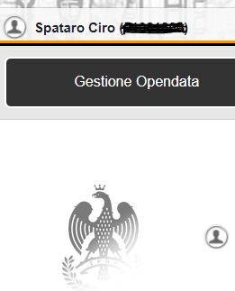
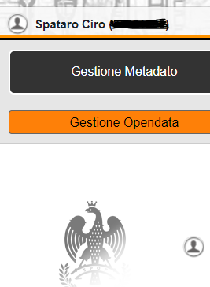
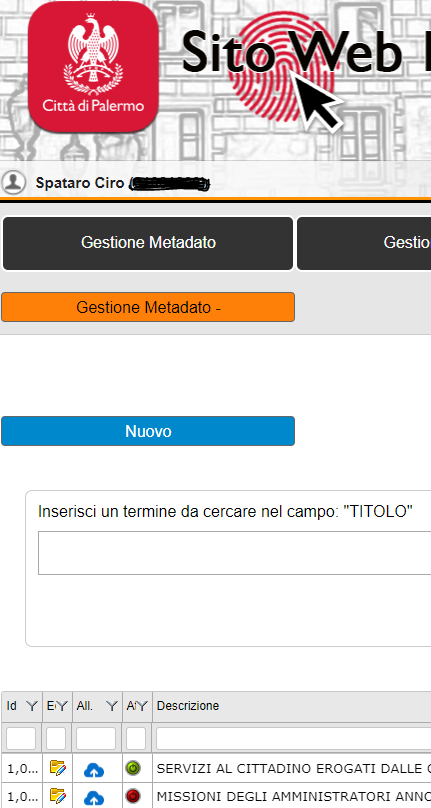
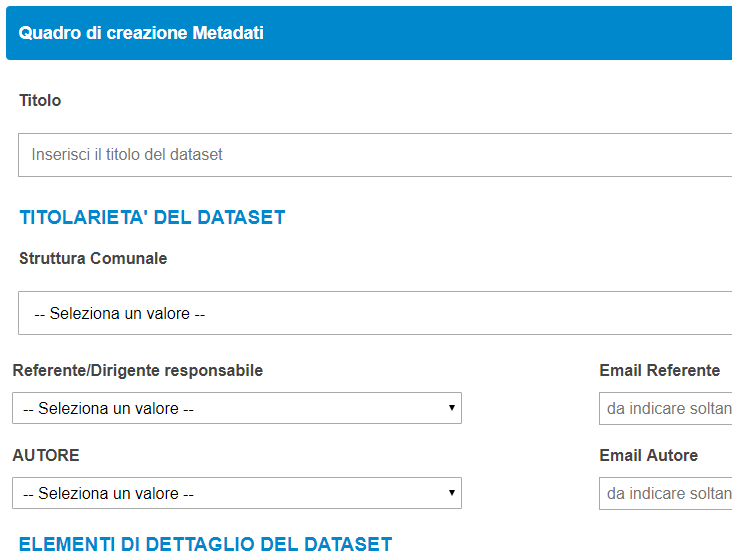
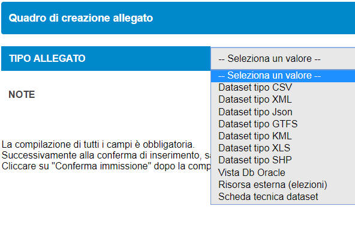
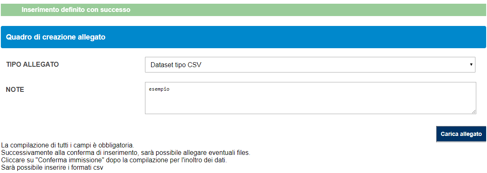
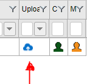
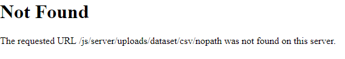

.. _h79384848122f38796644634b22416366:

Procedura per il caricamento dei dataset open data e metadati sul portale del comune di Palermo 
################################################################################################

Questo breve manuale descrive le procedure che i referenti tecnici e tematici open data degli uffici devono seguire passo passo per caricare i dataset nel portale del comune di Palermo \ |LINK1|\ .

.. toctree:: 
    :maxdepth: 3
    :caption: Indice 

    index

+--------------------------------------------------------------------------------+
|Riferimenti per il caricamento                                                  |
|                                                                                |
|Ciro Spataro - \ |LINK2|\  - tel. 091.7407340                                   |
|                                                                                |
|Settore Direzione Generale - Servizio Innovazione - UO “Transizione al digitale”|
+--------------------------------------------------------------------------------+

.. _h6544953174133332910222e767b4040:

Il portale open data comunale
=============================

Il portale \ |LINK3|\  è il portale open data del comune di Palermo operativo dal dicembre 2017.

Il portale è conforme allo standard nazionale \ |LINK4|\ . Essere “conforme allo standard nazionale DCAT_AP_IT” per un portale istituzionale, significa che i dataset del portale open data del comune di Palermo sono automaticamente esposti nel portale nazionale open data \ |LINK5|\  upe sempre automaticamente vengono esposti nel portale europeo dei dati in formato aperto \ |LINK6|\ . 

Le \ |STYLE0|\  rispetto alla vecchia versione del portale sono mutate anche se non sono stravolte, e procedere al caricamento con il nuovo pannello di controllo risulta anche un’attività più semplice.

\ |STYLE1|\ 

.. _h734343505f2432a79514f732138246c:

Accesso al pannello di controllo
================================

Per accedere al pannello di controllo, abilitante al caricamento dei dataset e dei metadati, andare al link \ |LINK7|\  (figura 1).

Cliccando sulla freccia rossa si aprono i campi per l’inserimento del numero della matricola e della password.

La password è quella che il referente comunale open data ha ricevuto dal webmaster e che è stata utilizzata per i precedenti caricamenti di dataset sulla vecchia versione del portale open data.

+----------+
|\ |IMG1|\ |
|          |
|(figura 1)|
+----------+

 

\ |STYLE2|\ 

A questo punto si apre il \ |STYLE3|\  (figura 2)

+----------+
|\ |IMG2|\ |
|          |
|(figura 2)|
+----------+

\ |STYLE4|\ 

Si clicca su “Gestione Opendata” (figura 3)

+----------+
|\ |IMG3|\ |
|          |
|(figura 3)|
+----------+

\ |STYLE5|\ 

E si apre questa schermata con il puls pulsante “\ |STYLE6|\ ” e sotto “\ |STYLE7|\ ” (figura 4)

+----------+
|\ |IMG4|\ |
|          |
|(figura 4)|
+----------+

\ |STYLE8|\ 

.. _h5646292b7e7c33555957333e7f414425:

Inserimento dei metadati del dataset
====================================

Premessa: come nella vecchia versione del pannello di caricamento dei dataset, anche nella nuova versione si costruisce prima il metadato che accompagna il dataset e successivamente si carica il dataset come allegato.

Si clicca “\ |STYLE9|\ ” (figura 5) e si apre un pannello in cui è possibile già vedere i dataset caricati. 

Quindi è possibile cominciare a creare un \ |STYLE10|\ , cliccando sul tasto azzurro “\ |STYLE11|\ ”.

+----------+
|\ |IMG5|\ |
|          |
|(figura 5)|
+----------+

\ |STYLE12|\ 

Si inizia, quindi a compilare i campi per la formazione dei metadati (figura 6).

.. _h1b77a4734687d2d5f192f1a5a356510:

Campo TAG
=========

Nella pagina del metadato, particolare attenzione deve essere posta nella compilazione del campo TAG. Bisogna inserire le parole di TAG, separate da virgola ``,`` e seguite da uno spazio, poi di nuovo la parola del TAG, seguita da ``,`` e seguita da spazio, e così via nel caso si debbano inserire due o più tag.

Una volta terminata la compilazione dei campi dei metadati, si clicca in basso su “\ |STYLE13|\ ”.

+----------+
|\ |IMG6|\ |
|          |
|(figura 6)|
+----------+

\ |STYLE14|\ 

.. _hd3a1c587b3c4f296811142c9336833:

Caricamento del dataset
=======================

Conclusa la fase di caricamento dei metadati, cioè le informazioni per spiegare cosa il dataset contiene al suo interno, si passa alla fase finale di caricamento del dataset.

Per attivare il caricamento, si parte dal catalogo dei titoli dei dataset elencati nella schermata (figura 7) che si presenta subito dopo aver concluso la fase di inserimento dei metadati.

Quindi si seleziona il titolo specifico del dataset che già abbiamo editato nella fase precedente e \ |STYLE15|\ .

+----------+
|\ |IMG7|\ |
|          |
|(figura 7)|
+----------+

\ |STYLE16|\ 

Si procede a cliccare sul tasto nero “Allegati metadato” (figura 8)

+----------+
|\ |IMG8|\ |
|          |
|(figura 8)|
+----------+

\ |STYLE17|\ 

Si apre un'altra schermata (figura 9) e si procede a cliccare sul tasto azzurro “\ |STYLE18|\ ”

+----------+
|\ |IMG9|\ |
|          |
|(figura 9)|
+----------+

\ |STYLE19|\ 

Si apre la schermata (figura 10) e si continua selezionando il campo a destra  --\ |STYLE20|\ --

+-----------+
|\ |IMG10|\ |
|           |
|(figura 10)|
+-----------+

\ |STYLE21|\ 

Si apre la schermata (figura 11) e \ |STYLE22|\ .

Nella stessa schermata si procede a inserire un breve testo nel campo \ |STYLE23|\ . Si può anche scrivere il titolo del dataset, lo stesso titolo utilizzato nella parte precedente per la titolazione del dataset.

Una volta effettuate queste due operazioni si clicca sul tasto in basso a destra “\ |STYLE24|\ ”

+-----------+
|\ |IMG11|\ |
|           |
|(figura 11)|
+-----------+

\ |STYLE25|\ 

La schermata successiva (figura 12) si apre con un messaggio: “\ |STYLE26|\ ”.

Quindi si passa all’ultima operazione che è quella di caricamento del file sul pannello di controllo. 

Si clicca sul tasto in basso a destra “\ |STYLE27|\ ”  e si seleziona dal pc il file da caricare.

\ |STYLE28|\ 

..  Note:: 

    Il nome del file deve essere scritto in minuscolo e senza alcun carattere particolare (come “_” ,  “/” ,  “,” “;”, ecc). 
    E’ consigliabile usare una parola breve, tanto il pannello di controllo provvederà in automatico a rinominare il file una volta caricato online.

\ |STYLE29|\ 

Una volta ultimato il caricamento del file, esso è reso immediatamente visibile nel portale online open data.

\ |STYLE30|\ 

+-----------+
|\ |IMG12|\ |
|           |
|(figura 12)|
+-----------+

\ |STYLE31|\ 

..  Note:: 

    da tenere presente prima della procedura di caricamento del dataset nel pannello “allegati”

\ |STYLE32|\ 

Nel pannello di caricamento del dataset a destra c’è un’\ |STYLE33|\  (figura 13).

Cliccando su questa icona si ha la visualizzazione del dataset. 

\ |STYLE34|\ 

+-----------+
|\ |IMG13|\ |
|           |
|(figura 13)|
+-----------+

\ |STYLE35|\ 

\ |STYLE36|\  cliccando su questa icona (a forma di nuvoletta di colore azzurro) verrà restituito un messaggio di errore “\ |STYLE37|\ ” come di seguito in figura 14:

+-----------+
|\ |IMG14|\ |
|           |
|(figura 14)|
+-----------+

\ |STYLE38|\ 

..  Attention:: 

    Una volta effettuato il caricamento del dataset sul pannello di controllo può capitare che lo stesso caricamento non sia andato a buon fine, in questo caso \ |STYLE39|\  di: file caricato con il nome \ |STYLE40|\ 
    
    Significa che il dataset, in formato CSV, non supera la validazione del pannello di caricamento.

\ |STYLE41|\ 

.. _h395d28166954667e4b22141354723639:

Il dataset in formato CSV
=========================

Se il formato del dataset è di tipo ``CSV`` è auspicabile impostare come separatore di campi, il “punto e virgola” ``;`` al fine di permettere la validazione con esito positivo dello stesso dataset da parte del software che gestisce il caricamento online sul portale open data del comune.

..  Hint:: 

    Un buon articolo che tratta l’argomento del file in formato CSV è disponibile a questo \ |LINK8|\ .
    (\ |STYLE42|\ ).

Al fine di ottenere un file CSV con il “punto e virgola” ``;``  come separatore dei campi è possibile vedere questo brevissimo tutorial:

|REPLACE1|

Nel fare questa operazione, disabilitare l'interpretazione del tipo campo all'apertura del CSV (impostare come "testo" tutti campi del CSV),  come si vede nel video di seguito:

|REPLACE2|

\ |STYLE43|\ 

.. _h5864f125f7387b28793484c584721:

Validazione dei formati CSV prima del caricamento
-------------------------------------------------

..  Important:: 

    Al fine di evitare quanto sopra indicato  è consigliabile, prima di effettuare il caricamento del dataset nel pannello di controllo, sottoporre il dataset ad una \ |STYLE44|\  da far fare ad un validatore online. Ecco due esempi di validatori online:
    
    * \ |LINK9|\  (si procede, quindi, a caricare il file \ |STYLE45|\  in questo sito, seguendo le indicazioni del sito. Premendo il tasto ``VALIDATE`` si avrà la restituzione degli eventuali errori con la riga in cui si trovano tali errori, se presenti nel dataset).
    
    * \ |LINK10|\ . 
    I due siti permettono di identificare e correggere eventuali errori nel dataset in formato \ |STYLE46|\  e solo in seguito si continua con il caricamento nel pannello di controllo del portale open data.

\ |STYLE47|\ 

.. _h776b2b5d2452155273f43c233d771:

Supporto nelle procedure di caricamento
=======================================

[Per eventuali problemi riscontrati in questa procedura di validazione del dataset, si potrà sempre fare riferimento, per aiuto, a Ciro Spataro \ |LINK11|\  - tel. 0917407340] 

.. bottom of content

.. |STYLE0| replace:: **procedure di caricamento dei dataset e dei metadati**

.. |STYLE1| replace:: **↓**

.. |STYLE2| replace:: **↓**

.. |STYLE3| replace:: **pannello di controllo**

.. |STYLE4| replace:: **↓**

.. |STYLE5| replace:: **↓**

.. |STYLE6| replace:: **Gestione Metadato**

.. |STYLE7| replace:: **Gestione Opendata**

.. |STYLE8| replace:: **↓**

.. |STYLE9| replace:: **Gestione Metadato**

.. |STYLE10| replace:: **NUOVO metadato**

.. |STYLE11| replace:: **Nuovo**

.. |STYLE12| replace:: **↓**

.. |STYLE13| replace:: **Conferma immissione**

.. |STYLE14| replace:: **↓**

.. |STYLE15| replace:: **si clicca nel logo a forma di nuvoletta di colore azzurro con la freccia verso l’alto**

.. |STYLE16| replace:: **↓**

.. |STYLE17| replace:: **↓**

.. |STYLE18| replace:: **Nuovo**

.. |STYLE19| replace:: **↓**

.. |STYLE20| replace:: **Seleziona un valore**

.. |STYLE21| replace:: **↓**

.. |STYLE22| replace:: **si seleziona il formato di dataset da caricare**

.. |STYLE23| replace:: **NOTE**

.. |STYLE24| replace:: **Conferma immissione**

.. |STYLE25| replace:: **↓**

.. |STYLE26| replace:: **Inserimento avvenuto con successo**

.. |STYLE27| replace:: **Carica allegato**

.. |STYLE28| replace:: **↓**

.. |STYLE29| replace:: **↓**

.. |STYLE30| replace:: **↓**

.. |STYLE31| replace:: **↓**

.. |STYLE32| replace:: **↓**

.. |STYLE33| replace:: **icona a forma di nuvoletta di colore azzurro**

.. |STYLE34| replace:: **↓**

.. |STYLE35| replace:: **↓**

.. |STYLE36| replace:: **Se la procedura di caricamento non è andata a buon fine**

.. |STYLE37| replace:: **Not Found**

.. |STYLE38| replace:: **↓**

.. |STYLE39| replace:: **non viene visualizzato il messaggio**

.. |STYLE40| replace:: **xxxxxxx.CSV.**

.. |STYLE41| replace:: **↓**

.. |STYLE42| replace:: *File CSV: cosa sono, come si aprono e come crearli. Impariamo cosa sono i file CSV, come sono strutturati e quali strumenti abbiamo a disposizione per aprirli e crearne di nuovi*

.. |STYLE43| replace:: **↓**

.. |STYLE44| replace:: **validazione**

.. |STYLE45| replace:: **CSV**

.. |STYLE46| replace:: **CSV**

.. |STYLE47| replace:: **↓**

.. |REPLACE1| raw:: html

    <iframe width="100%" height="500" src="https://www.youtube.com/embed/0JLvR4lCh-k" frameborder="0" allow="autoplay; encrypted-media" allowfullscreen></iframe>
    LibreOffice Calc: cambiare il separatore del CSV
.. |REPLACE2| raw:: html

    <iframe width="100%" height="500" src="https://www.youtube.com/embed/LI5izgQisjA" frameborder="0" allow="autoplay; encrypted-media" allowfullscreen></iframe>
    LibreOffice Calc: disabilitare l'interpretazione del tipo campo all'apertura del CSV

.. |LINK1| raw:: html

    <a href="https://opendata.comune.palermo.it/" target="_blank">https://opendata.comune.palermo.it</a>

.. |LINK2| raw:: html

    <a href="mailto:c.spataro@comune.palermo.it">c.spataro@comune.palermo.it</a>

.. |LINK3| raw:: html

    <a href="https://opendata.comune.palermo.it/" target="_blank">https://opendata.comune.palermo.it/</a>

.. |LINK4| raw:: html

    <a href="https://docs.italia.it/italia/daf/linee-guida-cataloghi-dati-dcat-ap-it/it/stabile/index.html" target="_blank">DCAT_AP_IT delle Linee Guida nazionali AGID per la valorizzazione del patrimonio informativo pubblico</a>

.. |LINK5| raw:: html

    <a href="https://www.dati.gov.it/" target="_blank">https://www.dati.gov.it/</a>

.. |LINK6| raw:: html

    <a href="http://europeandataportal.eu" target="_blank">http://europeandataportal.eu</a>

.. |LINK7| raw:: html

    <a href="https://www.comune.palermo.it/admin/" target="_blank">https://www.comune.palermo.it/admin/</a>

.. |LINK8| raw:: html

    <a href="https://www.html.it/articoli/file-csv-cosa-sono-come-si-aprono-e-come-crearli/" target="_blank">link</a>

.. |LINK9| raw:: html

    <a href="https://csvlint.io/" target="_blank">https://csvlint.io</a>

.. |LINK10| raw:: html

    <a href="https://try.goodtables.io/" target="_blank">https://try.goodtables.io</a>

.. |LINK11| raw:: html

    <a href="mailto:c.spataro@comune.palermo.it">c.spataro@comune.palermo.it</a>

.. |IMG7| image:: static/index_-_caricamento_dataset_opendata_comunePalermo_7.png
   :height: 32 px
   :width: 452 px

.. |IMG9| image:: static/index_-_caricamento_dataset_opendata_comunePalermo_9.png
   :height: 386 px
   :width: 454 px

.. |IMG10| image:: static/index_-_caricamento_dataset_opendata_comunePalermo_10.png
   :height: 370 px
   :width: 912 px

