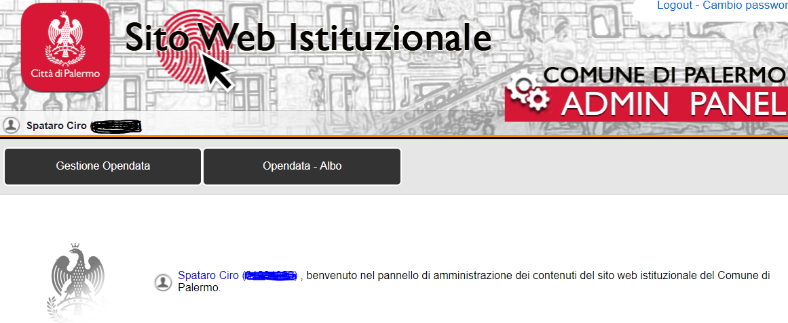
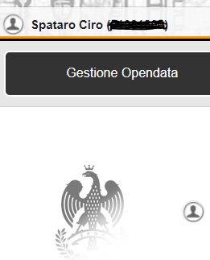
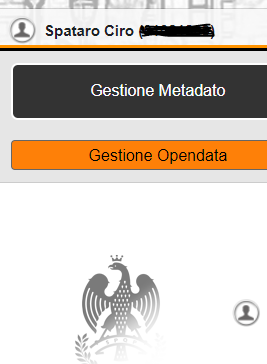
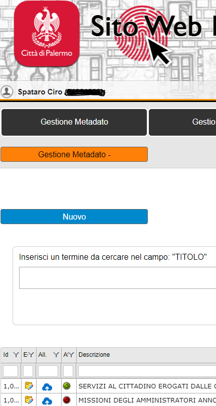
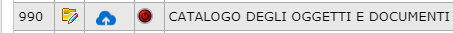
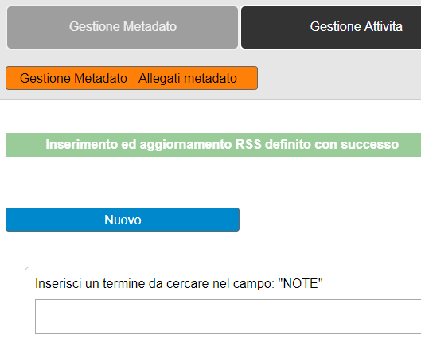
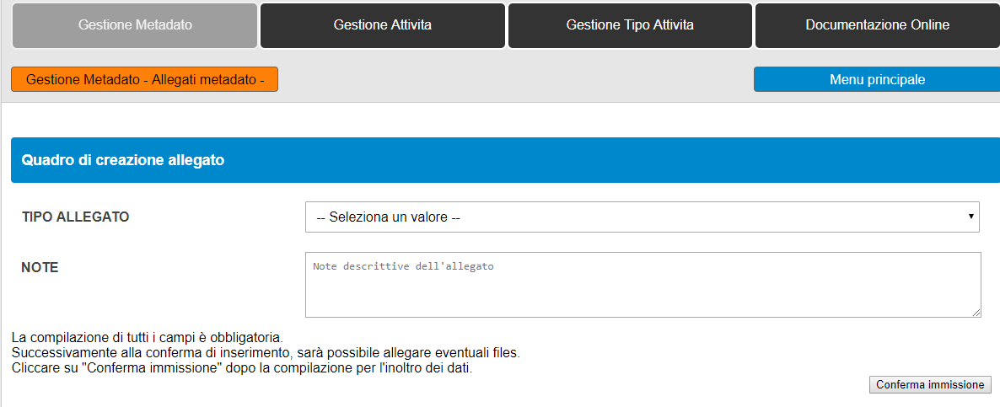

.. toctree:: 
    :maxdepth: 3
    :caption: Indice 

    indice

.. _h5b36a6b5c6c377d66104f322337701c:

Procedura per il caricamento dei dataset open data e metadati sul portale  open data del comune di Palermo 
***********************************************************************************************************

..  seealso:: 

    \ |STYLE0|\ 
    
    Ciro Spataro - \ |LINK1|\  - tel. 091.7407340
    
    Settore Servizi alla città - Servizio Innovazione - U.O. Transizione al digitale

.. _h6544953174133332910222e767b4040:

Il portale open data comunale
=============================

Il portale \ |LINK2|\  è il nuovo portale open data del comune di Palermo operativo dal dicembre 2017, in sostituzione della precedente versione \ |LINK3|\ .

Il nuovo portale è conforme allo standard nazionale DCAT_AP_IT delle Linee Guida nazionali AGID per la valorizzazione del patrimonio informativo pubblico. Essere per un portale istituzionale conforme allo standard nazionale DCAT_AP_IT significa che i dataset del portale open data del comune di Palermo sono automaticamente esposti nel portale nazionale open data dati.gov.it e sempre automaticamente vengono esposti nel portale europeo dei dati in formato aperto europeandataportal.eu.

Le procedure di caricamento dei dataset e dei metadati rispetto alla vecchia versione del portale sono mutate anche se non sono stravolte, e procedere al caricamento con il nuovo pannello di controllo risulta anche un attività più semplice.

\ |STYLE1|\ 

.. _h734343505f2432a79514f732138246c:

Accesso al pannello di controllo
================================

Per accedere al pannello di controllo, abilitante al caricamento dei dataset e dei metadati, andare al link \ |LINK4|\  (figura 1).

Cliccando sulla freccia rossa si aprono i campi per l’inserimento del numero della matricola e della password.

La password è quella che il referente comunale open data ha ricevuto dal webmaster e che è stata utilizzata per i precedenti caricamenti di dataset sulla vecchia versione del portale open data.

\ |IMG1|\  

(figura 1)

\ |STYLE2|\ 

A questo punto si apre il pannello di controllo (figura 2)

\ |IMG2|\ 

(figura 2)

\ |STYLE3|\ 

Si clicca su “Gestione Opendata” (figura 3)

\ |IMG3|\ 

(figura 3)

\ |STYLE4|\ 

E si apre questa schermata con il puls pulsante “Gestione Metadato” e sotto “Gestione Opendata” (figura 4)

\ |IMG4|\ 

(figura 4)

\ |STYLE5|\ 

.. _h5646292b7e7c33555957333e7f414425:

Inserimento dei metadati del dataset
====================================

Premessa: come nella vecchia versione del pannello di caricamento dei dataset, anche nella nuova versione si costruisce prima il metadato che accompagna il dataset e successivamente si carica il dataset come allegato.

Si clicca “Gestione Metadato” (figura 5) e si apre un pannello in cui è possibile già vedere i dataset caricati. 

Quindi è possibile cominciare a creare un NUOVO metadato, cliccando sul tasto azzurro “Nuovo”.

\ |IMG5|\ 

(figura 5)

\ |STYLE6|\ 

Si inizia, quindi a compilare i campi per la formazione dei metadati (figura 6).

Una volta terminata la compilazione dei campi dei metadati, si clicca in basso su “Conferma immissione”.

\ |IMG6|\  

(figura 6)

\ |STYLE7|\ 

.. _hd3a1c587b3c4f296811142c9336833:

Caricamento del dataset
=======================

Conclusa la fase di caricamento dei metadati, cioè le informazioni per spiegare cosa il dataset contiene al suo interno, si passa alla fase finale di caricamento del dataset.

Per attivare il caricamento, si parte dal catalogo dei titoli dei dataset elencati nella schermata (figura 7) che si presenta subito dopo aver concluso la fase di inserimento dei metadati.

Quindi si seleziona il titolo specifico del dataset che già abbiamo editato nella fase precedente e si clicca nel logo a forma di nuvoletta di colore azzurro con la freccia verso l’alto.

\ |IMG7|\ 

(figura 7)

\ |STYLE8|\ 

Si procede a cliccare sul tasto nero “Allegati metadato” (figura 8)

\ |IMG8|\  

(figura 8)

\ |STYLE9|\ 

Si apre un'altra schermata (figura 9) e si procede a cliccare sul tasto azzurro NUOVO

\ |IMG9|\  

(figura 9)

\ |STYLE10|\ 

Si apre la schermata (figura 10) e si continua selezionando il campo a destra  --Seleziona un valore--

\ |IMG10|\  

(figura 10)

\ |STYLE11|\ 

Si apre la schermata (figura 11) e si seleziona il formato di dataset da caricare.

Nella stessa schermata si procede a inserire un breve testo nel campo NOTE. Si può anche scrivere il titolo del dataset, lo stesso titolo utilizzato nella parte precedente per la titolazione del dataset.

Una volta effettuate queste due operazioni si clicca sul tasto in basso a destra “Conferma immissione”

\ |IMG11|\  

(figura 11)

\ |STYLE12|\ 

La schermata successiva (figura 12) si apre con un messaggio: “Inserimento avvenuto con successo”.

Quindi si passa all’ultima operazione che è quella di caricamento del file sul pannello di controllo. 

Si clicca sul tasto in basso a destra “Carica allegato”  e si seleziona dal pc il file da caricare.

\ |STYLE13|\ 

..  Note:: 

    Il nome del file deve essere scritto in minuscolo e senza alcun carattere particolare (come “_” ,  “/” ,  “,” “;”, ecc). 
    E’ consigliabile usare una parola breve, tanto il pannello di controllo provvederà in automatico a rinominare il file una volta caricato online.

\ |STYLE14|\ 

Una volta ultimato il caricamento del file, esso è reso immediatamente visibile nel portale online open data.

\ |STYLE15|\ 

\ |IMG12|\  

(figura 12)

\ |STYLE16|\ 

..  Note:: 

    da tenere presente prima della procedura di caricamento del dataset nel pannello “allegati”

\ |STYLE17|\ 

Nel pannello di caricamento del dataset a destra c’è un’icona a forma di nuvoletta di colore azzurro (figura 13).

Cliccando su questa icona si ha la visualizzazione del dataset. 

\ |STYLE18|\ 

\ |IMG13|\ 

(figura 13)

\ |STYLE19|\ 

\ |STYLE20|\  cliccando su questa icona (a forma di nuvoletta di colore azzurro) verrà restituito un messaggio di errore come di seguito:

\ |IMG14|\ .

(14)

\ |STYLE21|\ 

..  Attention:: 

    Una volta effettuato il caricamento del dataset può capitare che lo stesso caricamento non sia andato a buon fine, in questo caso \ |STYLE22|\  di: file caricato con il nome \ |STYLE23|\ 
    
    Significa che il dataset, in formato CSV, non supera la validazione del pannello di caricamento.

\ |STYLE24|\ 

.. _h5864f125f7387b28793484c584721:

Validazione dei formati CSV prima del caricamento
-------------------------------------------------

Al fine di evitare quanto sopra indicato  è consigliabile, prima di effettuare il caricamento del dataset nel pannello di controllo, sottoporre il dataset ad una \ |STYLE25|\  da far fare ad un validatore online. Ecco due esempi di validatori online:

* \ |LINK5|\  (si procede, quindi, a caricare il file \ |STYLE26|\  in questo sito, seguendo le indicazioni del sito. Premendo il tasto ``VALIDATE`` si avrà la restituzione degli eventuali errori con la riga in cui si trovano tali errori, se presenti nel dataset).

* \ |LINK6|\ . 

I due siti permettono di identificare e correggere eventuali errori nel dataset in formato \ |STYLE27|\  e solo in seguito si continua con il caricamento nel pannello di controllo del portale open data.

\ |STYLE28|\ 

.. _h776b2b5d2452155273f43c233d771:

Supporto nelle procedure di caricamento
=======================================

[Per eventuali problemi riscontrati in questa procedura di validazione del dataset, si potrà sempre fare riferimento, per aiuto, a Ciro Spataro \ |LINK7|\  - tel. 0917407340] 

.. bottom of content

.. |STYLE0| replace:: **Riferimenti per il caricamento**

.. |STYLE1| replace:: **↓**

.. |STYLE2| replace:: **↓**

.. |STYLE3| replace:: **↓**

.. |STYLE4| replace:: **↓**

.. |STYLE5| replace:: **↓**

.. |STYLE6| replace:: **↓**

.. |STYLE7| replace:: **↓**

.. |STYLE8| replace:: **↓**

.. |STYLE9| replace:: **↓**

.. |STYLE10| replace:: **↓**

.. |STYLE11| replace:: **↓**

.. |STYLE12| replace:: **↓**

.. |STYLE13| replace:: **↓**

.. |STYLE14| replace:: **↓**

.. |STYLE15| replace:: **↓**

.. |STYLE16| replace:: **↓**

.. |STYLE17| replace:: **↓**

.. |STYLE18| replace:: **↓**

.. |STYLE19| replace:: **↓**

.. |STYLE20| replace:: **Se la procedura di caricamento non è andata a buon fine**

.. |STYLE21| replace:: **↓**

.. |STYLE22| replace:: **non viene visualizzato il messaggio**

.. |STYLE23| replace:: **xxxxxxx.CSV.**

.. |STYLE24| replace:: **↓**

.. |STYLE25| replace:: **validazione**

.. |STYLE26| replace:: **CSV**

.. |STYLE27| replace:: **CSV**

.. |STYLE28| replace:: **↓**

.. |LINK1| raw:: html

    <a href="mailto:c.spataro@comune.palermo.it">c.spataro@comune.palermo.it</a>

.. |LINK2| raw:: html

    <a href="https://opendata.comune.palermo.it/" target="_blank">https://opendata.comune.palermo.it/</a>

.. |LINK3| raw:: html

    <a href="https://www.comune.palermo.it/opendata.php" target="_blank">https://www.comune.palermo.it/opendata.php</a>

.. |LINK4| raw:: html

    <a href="https://www.comune.palermo.it/admin/" target="_blank">https://www.comune.palermo.it/admin/</a>

.. |LINK5| raw:: html

    <a href="https://csvlint.io/" target="_blank">https://csvlint.io</a>

.. |LINK6| raw:: html

    <a href="https://try.goodtables.io/" target="_blank">https://try.goodtables.io</a>

.. |LINK7| raw:: html

    <a href="mailto:c.spataro@comune.palermo.it">c.spataro@comune.palermo.it</a>

.. |IMG1| image:: static/index_1.png
   :height: 392 px
   :width: 568 px

.. |IMG6| image:: static/index_6.png
   :height: 354 px
   :width: 472 px

.. |IMG8| image:: static/index_8.png
   :height: 372 px
   :width: 325 px

.. |IMG11| image:: static/index_11.png
   :height: 397 px
   :width: 592 px

.. |IMG12| image:: static/index_12.png
   :height: 324 px
   :width: 914 px

.. |IMG13| image:: static/index_13.png
   :height: 137 px
   :width: 142 px

.. |IMG14| image:: static/index_14.png
   :height: 97 px
   :width: 568 px
